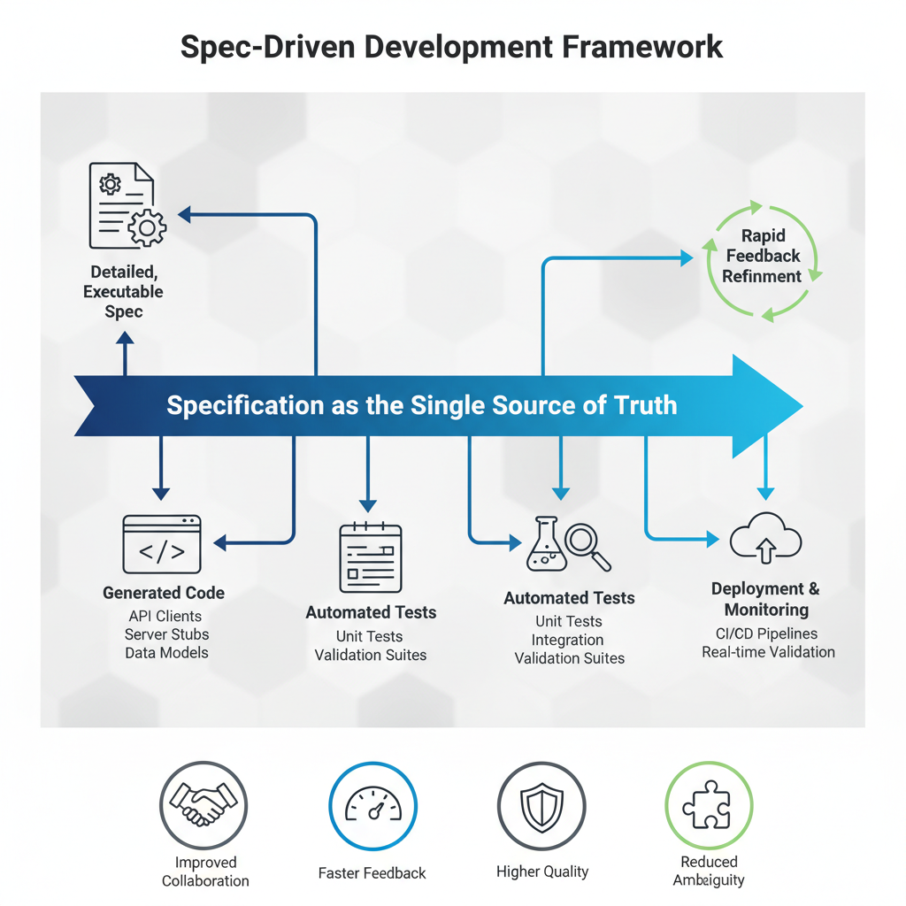

# Spec-Driven Development (SDD)

> **Ship specs, not stress.**
> A more accessible set of artifacts for Spec Driven Development. Forget fiddling with CLIs, endless scripts, and yak-shaving. Spec-Driven Development is about **writing clear specs that guide your workflow, product, and codebase** — without unnecessary clutter.

[](LICENSE)
[](https://github.com/iggym/spec-driven-development/stargazers)

<!-- TODO: Add badges for npm/pip package, CI build, or coverage once available -->

---

## 🌟 Why Spec-Driven Development?

If you’ve ever thought:

* “Why do I need to install 3 CLIs just to write a spec?”
* “Why does tooling get in the way of actually *thinking* about what I’m building?”
* “I just want simple, inspiring **guidelines** to help me define and evolve specs.”
* Look in the artifacts folder for some examples - this repo encourages you to use your preferred LLM chatbot to create your specs, plans and tasks.
…then you’re in the right place.

**SDD is lightweight inspiration.** It helps backend devs, frontend devs, data scientists, and even product teams focus on **specs that matter**, not on plumbing.

---

## ⚡ Quick Start

1. Clone the repo:

   ```bash
   git clone https://github.com/iggym/spec-driven-development.git
   cd spec-driven-development
   ```

2. Browse the prompts and guidelines. No installation, no setup, no tears.

3. Try a spec-driven workflow using this prompt:

   ```markdown
   You are an expert in Spec-Driven Development. Create a Feature Specification Document based on this idea: 
   [Describe the feature or project idea, e.g., "Build a real-time chat system for team collaboration"].

   Use this template:
   # Feature Specification: [Feature Name]

   ## Overview
   - **Purpose**: What problem does this feature solve, and for whom?
   - **Success Criteria**: How will we measure success? (e.g., user adoption, performance metrics)
   - **Scope**: What is included and excluded?

   ## User Stories
   - **Story 1**: As a [user type], I want [action] so that [benefit].
     - Acceptance Criteria: [List measurable criteria]
     - [NEEDS CLARIFICATION: If any ambiguity, e.g., "Auth method not specified - email/password?"]

   ## Non-Functional Requirements
   - **Performance**: [e.g., <2s response]
   - **Security**: [e.g., Encrypt messages]
   - **Compliance**: [e.g., GDPR data handling]
   - **Other**: [e.g., Accessibility]

   ## Constraints
   - **Organizational/Technical**: [e.g., Use existing auth system]

   ## Edge Cases
   - [List scenarios and handling]

   Principles to follow:
   - Focus on WHAT and WHY, not HOW (no tech stacks).
   - Mark ambiguities with [NEEDS CLARIFICATION].
   - Ensure requirements are testable and unambiguous.
   - Bake in security/compliance from the start.
   - Keep it concise yet complete.

   Output the full document.
   ```

💡 **Tip:** Copy this into your favorite editor or LLM, describe your idea, and instantly get a **feature spec** that’s clear, testable, and unambiguous.

---

## 🆚 How We Compare

* **GitHub Spec Kit**: great, but heavy — it drags you into scripts, CLIs, and unnecessary ceremony.
* **Spec-Driven Development**: *snackable, playful, human-first*. It’s about **inspiration and clarity**, not tooling overhead.

---

## 🛠️ How It Works

Think of SDD as a **compass**, not a cage.

* Write down **clear specs** that describe what you’re building.
* Use provided **prompts and templates** to keep things consistent.
* Extend into **workflows and pipelines** when you’re ready.

> Future vision: integrate with CI/CD pipelines, prompt libraries, and context-driven automation — while staying lightweight and fun.

---

## 🚀 Roadmap

* ✅ Prompts and templates to kickstart specs.
* ✅ Examples across APIs, data workflows, and product features.
* 🔜 Workflows and pipelines for teams.
* 🔜 Ecosystem of reusable prompts and contexts.
* 🔜 Visual diagrams and editor integrations.

---

## 🤝 Contributing

Yes please!

* Open an [issue](https://github.com/iggym/spec-driven-development/issues) to suggest a new prompt, workflow, or feature.
* Submit PRs for templates, docs, or improvements.
* Share your own spec-driven stories.

We’ll happily feature contributors on a future **community board / roadmap tracker**.

---

## 💬 Community & Support

* Use [Discussions](https://github.com/iggym/spec-driven-development/discussions) for questions, ideas, or wild experiments.
* Tag issues with `help wanted` if you’re stuck.

---

## 📜 License

MIT — use it, remix it, share it.

---

